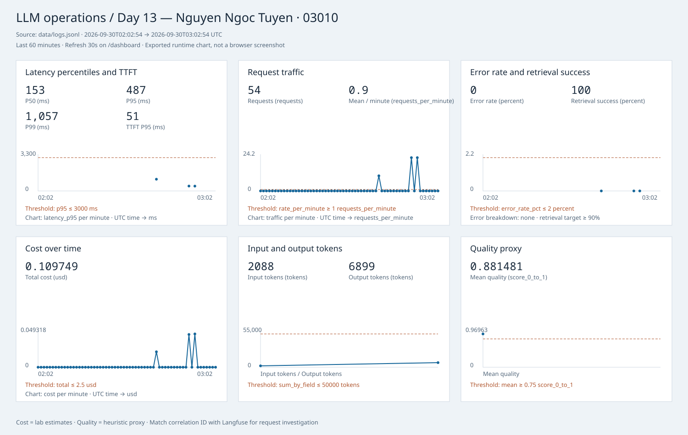

# Báo cáo cá nhân — CP0 đến CP2

- Họ tên: Nguyen Ngoc Tuyen
- MSSV: 03010; lớp: K4-L3B.
- Repository: https://github.com/Tuienn/K4-L3-DAY13-NguyenNgocTuyen-03010-Monitoring-LLMOps
- Phạm vi: dừng ở CP2; chưa thực hiện challenge CP3 và nộp bài CP4.
- Commit: xem `git log --oneline`; mỗi checkpoint một commit.

## CP0 — Baseline

Đã dùng môi trường `.venv` có sẵn và cấu hình `.env` của học viên. Workload 10 request đều HTTP 200, correlation ID còn `MISSING`. Log validator 30/100, dashboard contract 6/6, public tests 22 passed. Prompt `day13-chat` label `production` chưa tồn tại trên Langfuse nên ứng dụng dùng local-fallback; đây là blocker sẽ xử lý ở CP2.

Evidence thực tế: [workload](evidence/cp0-workload.txt), [logs](evidence/cp0-log-validator.txt), [dashboard](evidence/cp0-dashboard-validator.txt), [tests](evidence/cp0-pytest.txt).

## CP1 — Logging và PII

Log validator đạt **100/100** trên workload 10 request; không thiếu metadata, 10 correlation ID, không phát hiện PII. Tests: **25 passed**. Middleware giữ header `req-<8-hex>` hợp lệ, sinh ID khi thiếu/sai, xóa context trước và sau request, trả `x-request-id` và `x-response-time-ms`. `/chat` bind user hash, session, feature, model, env trước log đầu tiên. Scrubber xử lý đệ quy cả payload và metadata sau exception formatting, trước file writer/JSON renderer; che email, điện thoại VN, CCCD và thẻ. Test concurrency đối chiếu log/response của từng request để phát hiện rò context.

Evidence: [validator](evidence/cp1-log-validator.txt), [tests](evidence/cp1-pytest.txt), [workload](evidence/cp1-workload.txt), [structured logs đã scrub](evidence/cp1-structured-log.jsonl). Log baseline được giữ riêng tại `/tmp` để không trộn vào phép đo mới.

## CP2 — Traces, prompt và dashboard

Project được xác minh qua API: `day13-k4-l3b-03010`. Có **22 traces đã đọc lại từ Langfuse**, không lấy ID từ nguồn khác: 10 input baseline v1, cùng 10 input candidate v2, một input production sau promote và cùng input sau rollback. Đây là workload chạy qua ASGI transport của ứng dụng FastAPI thật (middleware, route, agent và SDK xuất traces), không phải fixture/mock Langfuse.

Cây observation trong trace `day13-agent-request`:

```text
lab-agent-run (AGENT)
├── retrieval (RETRIEVER)
└── generation (GENERATION)
```

Các decorators tắt capture input/output tự động. Retrieval chỉ ghi query preview đã scrub và doc_count/status. Generation ghi model, preview prompt/answer đã scrub, token input/output và cost; prompt managed được propagate và liên kết tới đúng version trên Langfuse. TTFT đo thời điểm fake LLM có token đầu tiên; cost là ước tính lab $3/M input và $15/M output, không phải hóa đơn nhà cung cấp. User ID được hash; session/feature được scrub trước trace attributes. Log `response_sent` có cả correlation ID và trace ID.

### Prompt version và rollback

- Prompt `day13-chat`: v1 giữ ba biến `feature`, `docs`, `message`; labels `baseline`, `production`.
- v2 thêm yêu cầu trả lời ngắn; label `candidate`.
- Label production đã đi theo chuỗi **v1 → v2 → v1**. Version được fetch thật từ Langfuse, không hard-code metadata.
- Sau update label, script xóa prompt cache; app chạy riêng cần đợi TTL 60s hoặc restart để dùng version mới.

Các trace đại diện:

- Baseline: [`e3800737bc81bc98c6809f3e649f954f`](https://cloud.langfuse.com/project/cmunhks7y0gwaad0dj53b0vnq/traces/e3800737bc81bc98c6809f3e649f954f), correlation `req-1631113c`.
- Candidate: [`435b463914f26ca2ed79fc5bfa378e4f`](https://cloud.langfuse.com/project/cmunhks7y0gwaad0dj53b0vnq/traces/435b463914f26ca2ed79fc5bfa378e4f), correlation `req-53ad723a`.
- Promote production v2: [`3e64450e88a4c40f6476d1ac575701b0`](https://cloud.langfuse.com/project/cmunhks7y0gwaad0dj53b0vnq/traces/3e64450e88a4c40f6476d1ac575701b0).
- Rollback production v1: [`9ddfe7aefa6482e886baa640b0525abf`](https://cloud.langfuse.com/project/cmunhks7y0gwaad0dj53b0vnq/traces/9ddfe7aefa6482e886baa640b0525abf).

Toàn bộ IDs, metadata, observation parent IDs và usage/cost nằm trong [API trace export](evidence/cp2-traces.json); [project](evidence/cp2-project.json), [hai prompt versions](evidence/cp2-prompt-versions.json), [lịch sử label](evidence/cp2-prompt-rollback.json), [kết quả kiểm chứng](evidence/cp2-verification.txt), [workload](evidence/cp2-workload.json), [logs của 22 traces](evidence/cp2-structured-log.jsonl). SDK resource attributes được loại khỏi export vì có public key; các lab metadata và số liệu API được giữ nguyên.

### Dashboard runtime

Mở `/dashboard` sau khi chạy API. Sáu panel đọc `data/logs.jsonl`, cửa sổ trượt 60 phút, refresh 30s; nguồn chuẩn và ngưỡng giữ nguyên [contract](../config/dashboard.yaml). Percentile dùng nearest-rank. Traffic tính cả request lỗi; error rate = failed/received; retrieval success tính các kết quả tool trên terminal events; thiếu mẫu số là N/A. Time buckets không có traffic hiển thị 0, latency thiếu mẫu hiển thị khoảng trống, không bịa latency.

Snapshot thực tế từ 2026-09-30T02:02:54.953377+00:00 đến 2026-09-30T03:02:54.953377+00:00 (UTC) chứa 54 request, gồm workload CP1 và các lần CP2. P50=153.0ms, P95=487.0ms, P99=1057.0ms, TTFT P95=51.0ms; error=0.0%, retrieval success=100.0%; cost=$0.109749; input/output=2088/6899 tokens; quality mean=0.8815.



Đây là biểu đồ được xuất trực tiếp từ dữ liệu runtime, **không phải ảnh chụp trình duyệt**. [HTML snapshot](evidence/11-dashboard-overview.html), [SVG](evidence/11-dashboard-overview.svg), [số liệu](evidence/cp2-dashboard-data.json). Script [export_dashboard.py](../scripts/export_dashboard.py) tái tạo chart bằng cùng source.

### SLO và alerts

[SLO](../config/slo.yaml): 99.5% request thành công trong 3000ms trên 28 ngày. Baseline TTFT ~50ms và CP2 latency dưới ngưỡng; 3000ms dành headroom cho retrieval/prompt fetch. Workload lab nhỏ chưa chứng minh đạt SLO dài hạn. Error budget = 0.5% tổng request; với 10,000 request cho phép tối đa 50 request lỗi/chậm. Mỗi request chỉ tính một bad event, không cộng lỗi và chậm hai lần.

[Ba rule](../config/alert_rules.yaml): HighLatencyP95 > 3000ms, HighErrorRate > 2%, LowRetrievalSuccess < 90%, mỗi điều kiện kéo dài 5 phút; có severity, owner và Slack `#k4-l3b-alerts`. [Runbooks](../docs/alerts.md) đi từ metric/time range → log/correlation ID → trace/span → mitigation → xác minh khôi phục. Đây là định nghĩa lab, chưa nối webhook Slack hoặc scheduler.

## Kết quả kiểm tra và giới hạn

- [Pytest](evidence/01-pytest.txt): 28 passed.
- [Log validator](evidence/02-log-validator.txt): 100/100, không thiếu context hoặc PII.
- [Dashboard validator](evidence/03-dashboard-validator.txt): 6/6.
- [PII runtime](evidence/05-pii-redaction.txt): input mẫu lấy từ repo, log preview đã che. Không đưa PII gốc vào evidence.
- Test bổ sung kiểm tra concurrency/context isolation, nested scrubber, CCCD/thẻ, generation usage/cost và dashboard error/time-window aggregation.

Quyết định kỹ thuật: dashboard đọc JSONL để khớp contract, Langfuse dùng cho tracing/prompt; correlation ID nối hai nguồn. Không dùng quality heuristic làm kết luận chất lượng thực hoặc cost fake làm chi phí đã thanh toán.

Blocker thực tế: prompt production chưa tồn tại gây fallback; tạo v1/v2 và xác minh managed prompt trên generation giải quyết. API trace legacy trả HTTP 410 trên project mới; chuyển sang [Observations API v2](https://langfuse.com/docs/api-and-data-platform/features/public-api) và tái dựng cây từ parentObservationId. Môi trường không có trình duyệt khả dụng: đã lưu API export thật; học viên đồng ý bổ sung các ảnh 06–10 từ Langfuse.

Metrics xác định triệu chứng/khoảng thời gian; logs chọn request bằng correlation ID; trace cùng ID xác định bước chậm/lỗi. Prompt version cho biết config thực tế đã dùng, token/cost cho biết mức sử dụng, SLO lượng hóa mục tiêu và rollback khôi phục version trước khi có regression. Đây là giải thích luồng vận hành, chưa phải kết luận incident CP3.

### Phần ảnh do học viên bổ sung

Cần lưu ảnh trong thư mục `evidence/`: `06-trace-list.png`, `07-trace-waterfall.png`, `08-trace-metadata.png`, `09-prompt-versions.png`, `10-prompt-rollback.png`. Chưa dẫn link ảnh chưa tồn tại. Xem [hướng dẫn evidence](evidence/README.md). API export không được gọi là screenshot; ảnh rollback hiện tại có thể chứng minh production=v1, còn lịch sử v1→v2→v1 đã ghi từ API thật.

CP3/challenge và CP4/nộp LMS nằm ngoài phạm vi yêu cầu. Báo cáo kỹ thuật này cần học viên rà soát, hiểu và giải thích khi demo.
